# 📱 Proyecto de Aplicación Móvil - Asignación 1

**Integrantes del grupo:**
- Cabezas Diaz Renzo Edgar 20224558
- David Vela Larrea 20202209
- Diego Arturo Huaman Bonilla 20211287
- Rodrigo Alonso Lara Camacho 20211415
-
---

## 🛠️ Entorno de Desarrollo
El entorno de desarrollo de nuestra aplicación móvil para la administración de tareas está compuesto por una combinación de tecnologías orientadas al desarrollo multiplataforma, backend robusto y servicios en la nube. A continuación, detallamos cada una de las herramientas que estamos definiendo para utilizar, su propósito y cómo fueron configuradas para el proyecto.

### 1.Flutter
Descripción: Framework de código abierto desarrollado por Google, permite crear aplicaciones móviles nativas para Android e iOS a partir de un único código base.

Instalación:
Descargar el SDK desde flutter.dev.
Agregar Flutter al PATH del sistema.
Ejecutar flutter doctor para verificar dependencias y configuraciones necesarias.
Instalar un editor como Visual Studio Code o Android Studio, con el plugin de Flutter y Dart.

### 2.Ruby on Rails (Backend)
Descripción: Framework MVC escrito en Ruby, ideal para desarrollar aplicaciones web robustas con APIs RESTful.

Instalación:
Instalar Ruby (vía RVM o rbenv).
Instalar Rails mediante el comando gem install rails.
Crear el proyecto con rails new backend_api --api para iniciar una API backend.
Configurar CORS y rutas para comunicar con la app Flutter.

### 3.Base de Datos PostgreSQL (Azure Database for PostgreSQL)
Descripción: Sistema de gestión de bases de datos relacional, utilizado para almacenar los datos estructurados de la aplicación como usuarios, tareas y categorías.

Instalación:
Crear una instancia en el portal de Azure.
Configurar firewall para permitir acceso desde el backend.
Usar el cliente psql o herramientas como PgAdmin para gestionar la base de datos.
Configurar las credenciales en el archivo database.yml del backend Ruby.

### 4.Azure Blob Storage
Descripción: Servicio de almacenamiento de objetos no estructurados en la nube, usado para guardar imágenes asociadas a las tareas o categorías.

Instalación:
Crear una cuenta de almacenamiento en Azure.
Crear un contenedor para las imágenes.
Generar SAS Tokens para acceso seguro desde el backend.
Integrar con el backend utilizando gemas como azure-storage-blob.

### 5.Servicio LLM (Large Language Model) Externo
Descripción: Modelo de lenguaje con IA usado para generar automáticamente listas de tareas personalizadas según las necesidades del usuario.

Integración:
Acceso vía API RESTful.
Configuración de autenticación con API Key o Bearer Token.
Uso de la biblioteca Net::HTTP o HTTParty en Ruby para enviar solicitudes al modelo.

### 6.Microsoft Azure (Plataforma de Despliegue)
Descripción: Plataforma cloud donde se alojan todos los servicios: backend, base de datos y almacenamiento.

Configuración:
Uso del Servicio de Aplicaciones de Azure para desplegar el backend Ruby.
Configuración de variables de entorno (por ejemplo, claves y URIs).
Uso de GitHub Actions para automatizar despliegues.

---
## 🚀 Diagrama de Despliegue

#### El diagrama de despliegue representa la arquitectura de una aplicación móvil desarrollada en Flutter que se comunica con un backend Ruby a través de solicitudes HTTP API. Este backend está desplegado en un Servicio de Aplicaciones dentro de la nube de Azure. La aplicación maneja datos estructurados mediante una base de datos PostgreSQL alojada en Azure Database for PostgreSQL, y archivos multimedia (como imágenes) a través de Azure Blob Storage. Además, el sistema integra un servicio LLM (modelo de lenguaje) externo, encargado de generar listas de tareas utilizando inteligencia artificial, al cual el backend envía solicitudes específicas. La arquitectura sigue un enfoque modular que separa claramente los componentes de cliente, lógica de negocio, almacenamiento, base de datos y generación inteligente.
---

## ☁️ Requisitos No Funcionales

### Autenticación segura entre cliente y servidor:
La aplicación móvil en Flutter debe comunicarse con el backend mediante HTTPS cada solicitud enviada al servidor Ruby.

### Disponibilidad del backend:
El Servicio de Aplicaciones de Azure que ejecuta el backend Ruby garantiza disponibilidad continua.

### Acceso rápido a imágenes:
El acceso a imágenes almacenadas en Azure Blob Storage debe realizarse mediante URLs firmadas (SAS tokens).

### Tolerancia a fallos en la generación IA:
Las solicitudes al servicio LLM deben manejar errores y tiempos de espera, permitiendo mostrar mensajes adecuados al usuario si el generador falla o demora.

### Eficiencia en consultas a la base de datos:
Las consultas del backend Ruby hacia PostgreSQL deben estar optimizadas con índices y paginación para garantizar tiempos de respuesta bajos, incluso con grandes volúmenes de datos.

### Escalabilidad del sistema:
Cada componente (backend, base de datos, almacenamiento y servicio IA) debe poder escalarse de forma independiente según la demanda de usuarios o procesamiento.

---

## ✅ Diagrama de casos de uso (Requisitos funcionales)

### Autenticación y Perfil

#### Registro de Usuario

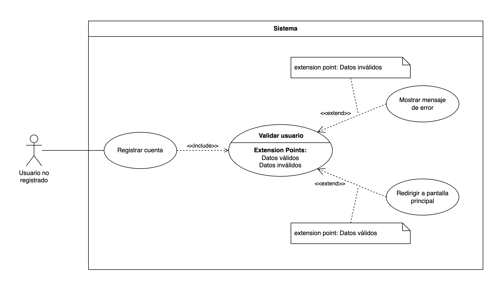

#### Inicio de Sesión

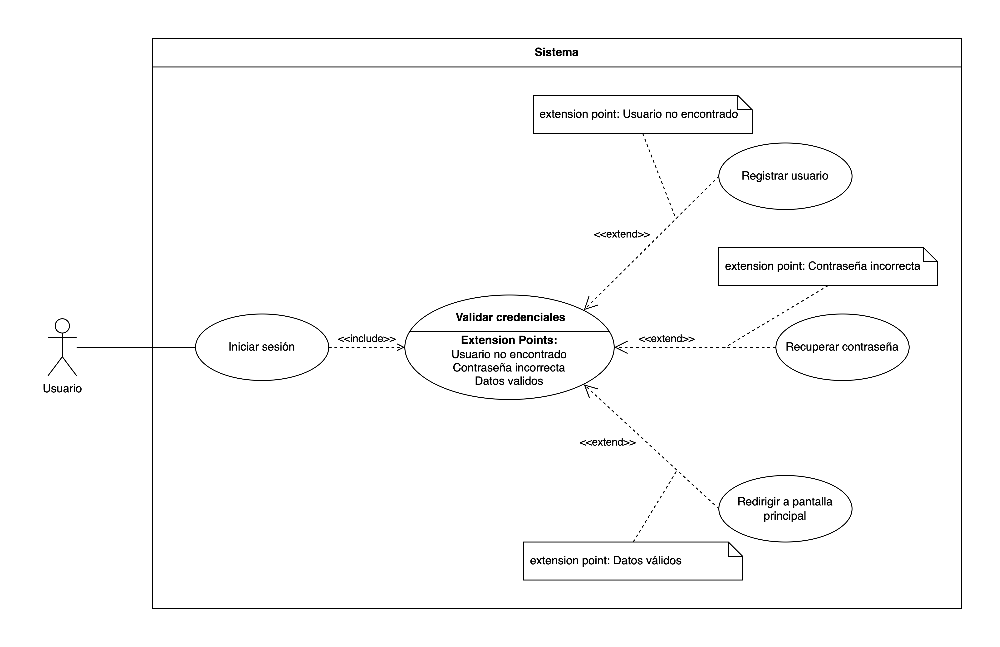

#### Restablecer Contraseña

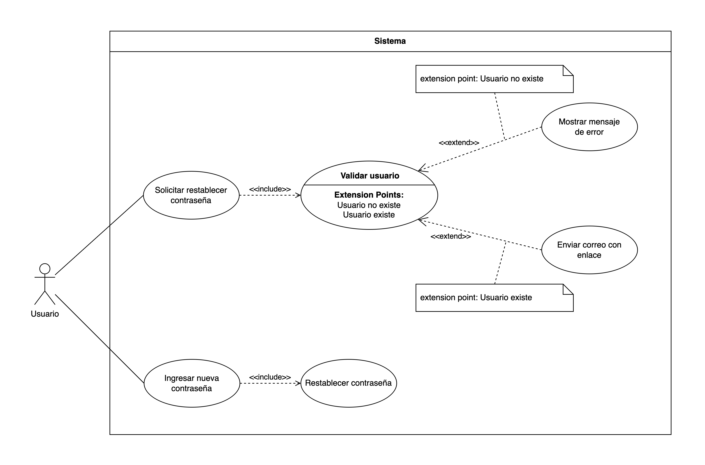

#### Actualizar Datos del Usuario

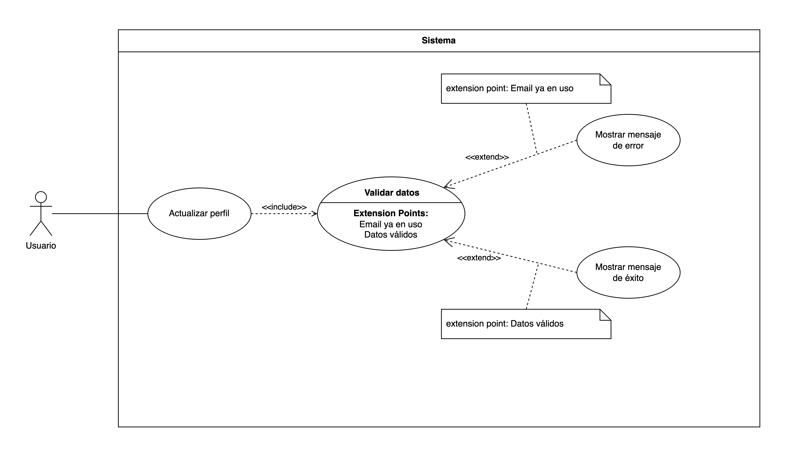

---

### Gestión de Tareas

#### Crear Tarea

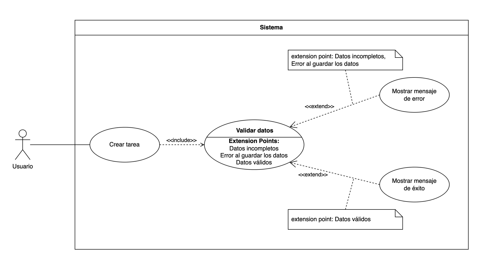

#### Editar Tarea

#### Eliminar tarea
Actor: Usuario
Caso de Uso: Eliminar tarea

Flujo:

El Usuario selecciona una tarea para eliminar.

El sistema muestra una confirmación para asegurarse de que el Usuario quiere eliminar la tarea.

Si el Usuario confirma, el sistema elimina la tarea de la base de datos.

Después de eliminar la tarea, el sistema muestra un mensaje de confirmación y regresa al inicio.

Diagrama de Caso de Uso:
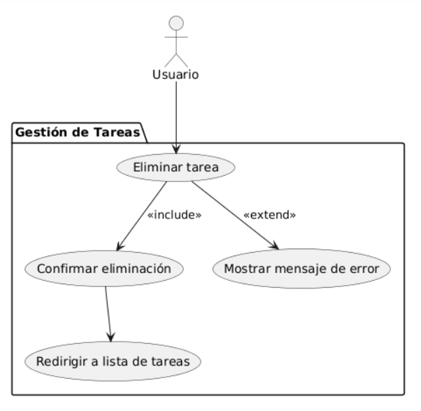

#### Visualizar todas las tareas
Actor: Usuario
Caso de Uso: Visualizar todas las tareas

Flujo:

El Usuario solicita ver todas las tareas.

El sistema consulta la base de datos y muestra todas las tareas disponibles.

Diagrama de Caso de Uso: 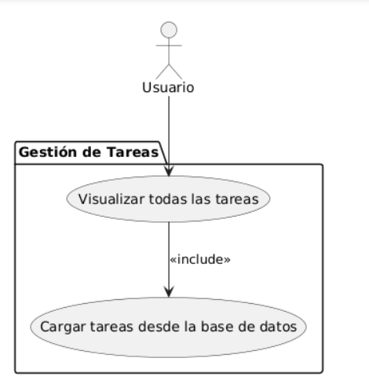

#### Marcar tarea como completada
Actor: Usuario
Caso de Uso: Marcar tarea como completada

Flujo:

El Usuario selecciona una tarea para marcarla como completada.

El sistema actualiza el estado de la tarea en la base de datos.

Después de la actualización, el sistema muestra un mensaje de confirmación.

El sistema regresa al "Marcar tarea como completada" para permitir al Usuario realizar más cambios.

Diagrama de Caso de Uso: 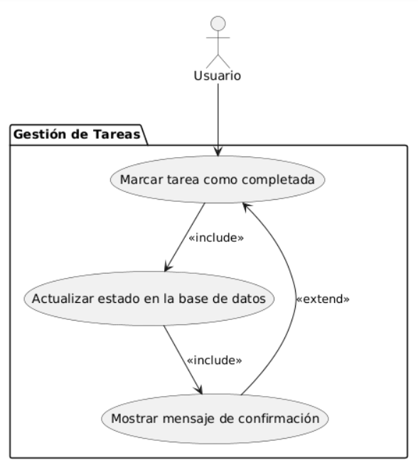

#### Buscar tareas y listas
Actor: Usuario
Caso de Uso: Buscar tareas y listas

Flujo:

El Usuario solicita buscar tareas o listas específicas.

El sistema consulta la base de datos y devuelve las tareas y listas que coinciden con los criterios de búsqueda.

Diagrama de Caso de Uso: 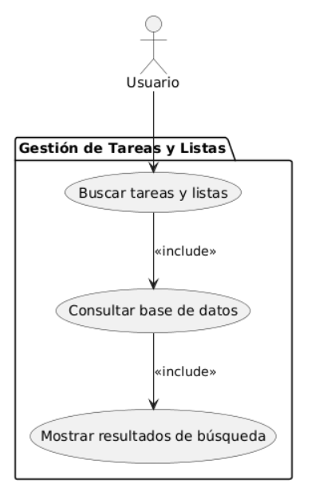

---

### Gestión de Listas

#### Crear lista
Actor: Usuario
Caso de Uso: Crear lista

Flujo:

El Usuario ingresa el nombre y detalles para crear una nueva lista.

El sistema guarda la nueva lista en la base de datos.

Después de guardar la lista, el sistema muestra un mensaje de confirmación.

El sistema luego regresa al inicio o a la pantalla principal.

Diagrama de Caso de Uso: 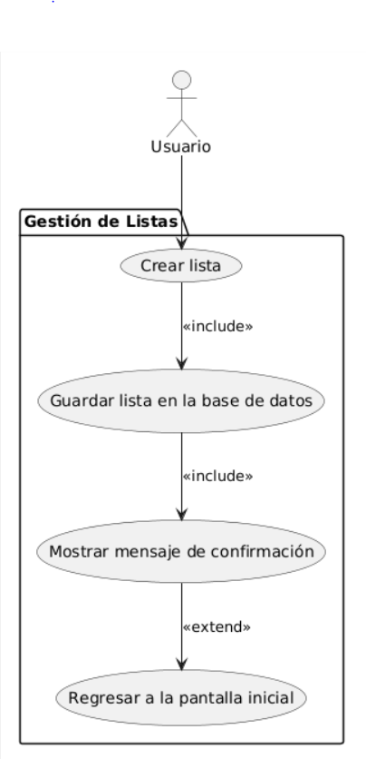

#### Editar lista (cambiar nombre, color o descripción)
Actor: Usuario
Caso de Uso: Editar lista (cambiar nombre, color o descripción)

Flujo:

El Usuario selecciona una lista para editar.

El sistema valida que los datos ingresados sean correctos.

Si la validación es exitosa:

El sistema guarda los cambios en la base de datos.

Muestra un mensaje de confirmación y regresa al inicio.

Si la validación falla:

El sistema muestra un mensaje de error.

Diagrama de Caso de Uso: 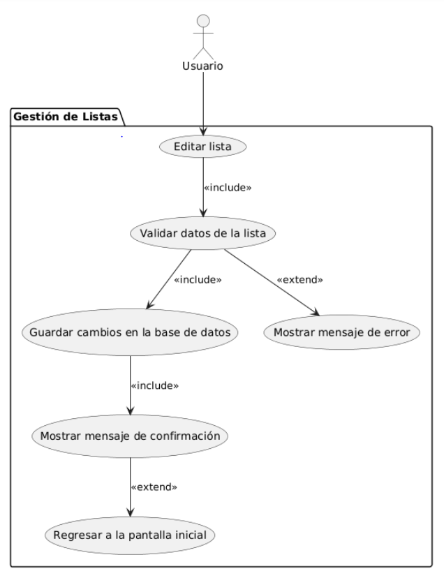

#### Eliminar lista
Actor: Usuario
Caso de Uso: Eliminar lista

Flujo:

El Usuario selecciona una lista para eliminar.

El sistema valida que la lista se pueda eliminar.

Si la validación es exitosa:

El sistema elimina la lista de la base de datos.

Muestra un mensaje de confirmación y regresa al inicio.

Si la validación falla:

El sistema muestra un mensaje de error.

Diagrama de Caso de Uso: 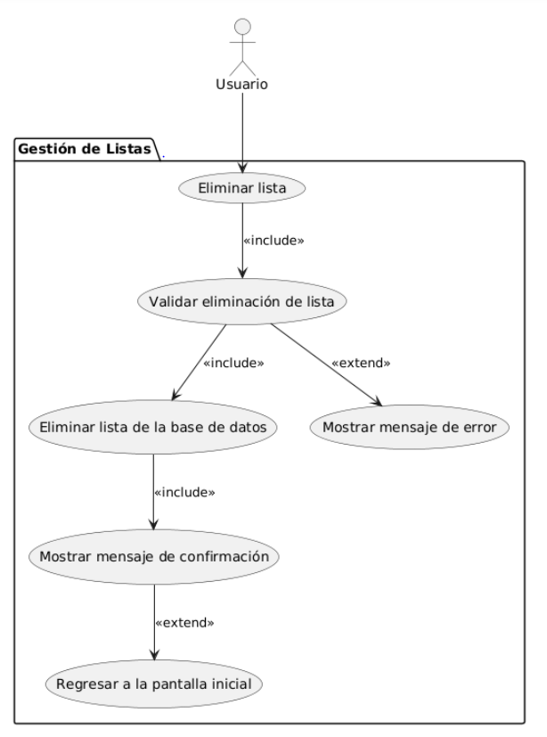

#### Ver detalles de lista
Actor: Usuario
Caso de Uso: Ver detalles de lista

Flujo:

El Usuario selecciona una lista para ver sus detalles.

El sistema consulta la base de datos y devuelve los detalles de la lista seleccionada.

Diagrama de Caso de Uso: 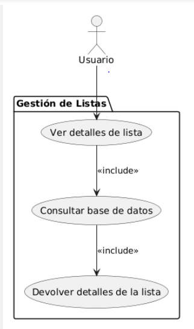

#### Visualizar todas las listas
Actor: Usuario
Caso de Uso: Visualizar todas las listas

Flujo:

El Usuario solicita ver todas las listas.

El sistema consulta la base de datos y muestra todas las listas disponibles.

Diagrama de Caso de Uso: 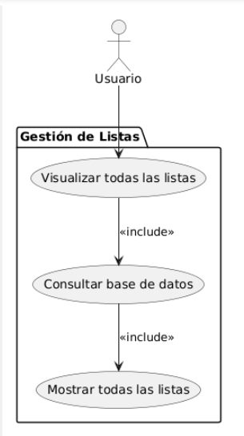

#### Asignar/desasignar tareas de una lista
Actor: Usuario
Caso de Uso: Asignar/desasignar tareas de una lista

Flujo:

El Usuario selecciona una lista y una tarea para asignar o desasignar.

El sistema realiza la acción correspondiente (asignar o desasignar) de la tarea en la lista.

El sistema actualiza la base de datos con el cambio realizado.

Después de la actualización, el sistema muestra un mensaje de confirmación.

El sistema regresa al "Asignar/desasignar tareas de una lista" para permitir al Usuario continuar con otras asignaciones o desasignaciones.
Diagrama de Caso de Uso: 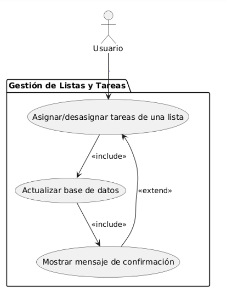

#### Generar Lista con Tareas usando Inteligencia Artificial

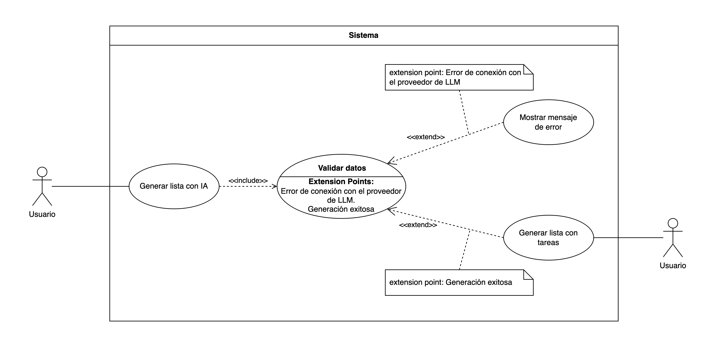

--------

## 📚 Descripción de Casos de Uso

---
