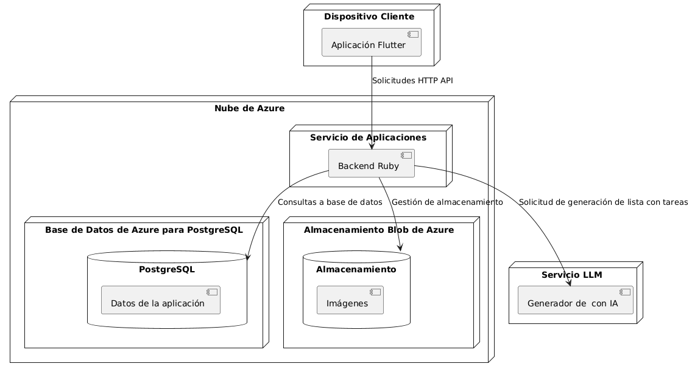

# 📱 Proyecto de Aplicación Móvil - Asignación 1

  
**Integrantes del grupo:**  
- Cabezas Diaz Renzo Edgar 20224558
- David Vela Larrea 
-   
-
-
---

## 🛠️ Entorno de Desarrollo

---
## 🚀 Diagrama de Despliegue

#### El diagrama de despliegue representa la arquitectura de una aplicación móvil desarrollada en Flutter que se comunica con un backend Ruby a través de solicitudes HTTP API. Este backend está desplegado en un Servicio de Aplicaciones dentro de la nube de Azure. La aplicación maneja datos estructurados mediante una base de datos PostgreSQL alojada en Azure Database for PostgreSQL, y archivos multimedia (como imágenes) a través de Azure Blob Storage. Además, el sistema integra un servicio LLM (modelo de lenguaje) externo, encargado de generar listas de tareas utilizando inteligencia artificial, al cual el backend envía solicitudes específicas. La arquitectura sigue un enfoque modular que separa claramente los componentes de cliente, lógica de negocio, almacenamiento, base de datos y generación inteligente.
---

## ☁️ Requisitos No Funcionales

## Autenticación segura entre cliente y servidor:
La aplicación móvil en Flutter debe comunicarse con el backend mediante HTTPS cada solicitud enviada al servidor Ruby.

## Alta disponibilidad del backend:
El Servicio de Aplicaciones que ejecuta el backend Ruby en Azure debe estar configurado con redundancia y escalado automático para garantizar disponibilidad continua.

## Acceso rápido a imágenes:
El acceso a imágenes almacenadas en Azure Blob Storage debe realizarse mediante URLs firmadas (SAS tokens).

## Tolerancia a fallos en la generación IA:
Las solicitudes al servicio LLM deben manejar errores y tiempos de espera, permitiendo mostrar mensajes adecuados al usuario si el generador falla o demora.

## Eficiencia en consultas a la base de datos:
Las consultas del backend Ruby hacia PostgreSQL deben estar optimizadas con índices y paginación para garantizar tiempos de respuesta bajos, incluso con grandes volúmenes de datos.

## Escalabilidad del sistema:
Cada componente (backend, base de datos, almacenamiento y servicio IA) debe poder escalarse de forma independiente según la demanda de usuarios o procesamiento.

---

## ✅ Diagrama de casos de uso (Requisitos funcionales) 

---

## 📚 Descripción de Casos de Uso

---
